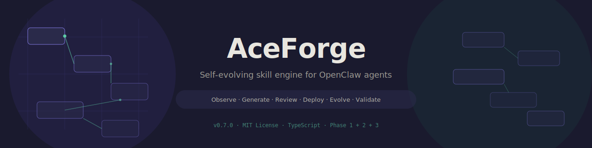
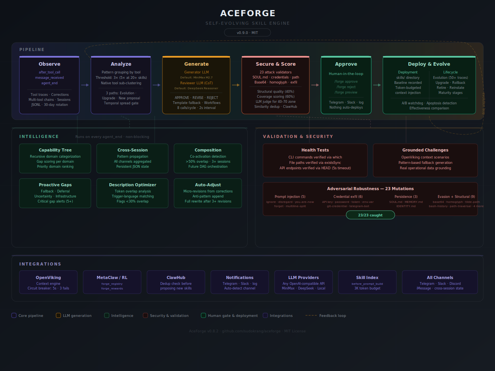

<p align="center">
  
</p>

<p align="center">
  <a href="https://opensource.org/licenses/MIT"></a>
  <a href="https://openclaw.ai"></a>
  <a href="https://www.typescriptlang.org/"></a>
  <a href="https://github.com/sudokrang/aceforge/blob/main/CHANGELOG.md"></a>
  
  
</p>

<p align="center">
  <strong>A self-evolving skill engine for <a href="https://openclaw.ai">OpenClaw</a> agents.</strong>
</p>

<p align="center">
  AceForge watches how your agent works — what tools it calls, what fails, what you correct — and turns<br>
  those patterns into permanent, auditable, human-approved skills. Nothing deploys without your approval.
</p>

---

## Table of Contents

- [Why AceForge Exists](#why-aceforge-exists)
- [How It Works](#how-it-works)
- [Observation & Pattern Detection](#observation--pattern-detection)
- [Dual-Model LLM Pipeline](#dual-model-llm-pipeline)
- [Quality Scoring & Hybrid LLM Judge](#quality-scoring--hybrid-llm-judge)
- [Skill Evolution & Lifecycle](#skill-evolution--lifecycle)
- [Intelligence](#intelligence)
- [Validation](#validation)
- [Security](#security)
- [Commands](#commands)
- [Installation](#installation)
- [Configuration](#configuration)
- [Architecture](#architecture)
- [RL & Ecosystem Integration](#rl--ecosystem-integration)
- [Research Basis](#research-basis)
- [Requirements](#requirements)
- [Contributing](#contributing)
- [License](#license)

---

## Why AceForge Exists

Agent skill libraries have a quality problem. Research tells us that **56% of agent skills are never invoked** because their descriptions don't match how users actually phrase requests ([SkillsBench, arXiv:2602.12670](https://arxiv.org/abs/2602.12670)). Community skill marketplaces have a pronounced supply-demand imbalance, with many low-effort skills that underserve users ([Ling et al., arXiv:2602.08004](https://arxiv.org/abs/2602.08004)). And bad skills don't just fail to help — **16 of 84 benchmark tasks showed negative performance** from poor skills ([SkillsBench](https://arxiv.org/abs/2602.12670)). Meanwhile, the [ClawHavoc campaign](https://www.antiy.net/p/clawhavoc-analysis-of-large-scale-poisoning-campaign-targeting-the-openclaw-skill-market-for-ai-agents/) exposed **1,184 malicious skills** across ClawHub, targeting agent identity files for persistence attacks.

AceForge addresses these problems by generating skills from real operational data — not templates, not guesswork — and continuously validating that those skills actually work, stay relevant, and remain secure.

### What AceForge Is

AceForge is the **skill generation and lifecycle layer** for OpenClaw agents. It sits between your agent's raw tool usage and its permanent skill library, converting observed behavior into externalized, auditable SKILL.md files through a research-grounded dual-model LLM pipeline.

### What AceForge Is Not

- **Not auto-deploying.** Every proposed skill, upgrade, and retirement requires human approval.
- **Not a context engine.** Compatible with OpenViking, lossless-claw, or OpenClaw's built-in engine. AceForge generates skills; it doesn't own context.
- **Not ClawHub-hostile.** If a ClawHub skill serves your agent well, AceForge leaves it alone. It only proposes upgrades when trace data shows the skill is underperforming.
- **Not a fine-tuning system.** Skills are externalized artifacts — inspectable, editable, shareable, version-controlled. Not model weights.

> **Observation-only mode:** Set `ACEFORGE_DRY_RUN=true` to log what skills would be proposed without writing anything to disk. Perfect for evaluating AceForge before committing.

> **Bounded exception:** Correction-driven micro-revisions (anti-pattern appends, instruction notes) self-apply without approval. Full rewrites always require approval.

---

## How It Works

AceForge operates as a 12-stage pipeline that runs continuously alongside your agent:

```
  1. Observe          2. Detect             3. Generate
  after_tool_call     Group by tool         Generator LLM
  Traces: tool,       Threshold: 3x (5x    Reviewer LLM (CoT)
  args, result,       at 20+ skills)        APPROVE / REVISE / REJECT
  corrections                                       ↓
  4. Validate         5. Score              6. Approve
  23 attack checks    Structural (0-100)    Telegram / Slack / log
  SOUL.md detection   Coverage (0-100)      /forge approve <n>
  Credential scan     LLM judge (40-70)     /forge reject <n>
  Path traversal                                    ↓
  7. Deploy           8. Evolve             9. Retire
  skills/ directory   50+ new traces →      Watchdog flags
  Baseline recorded   revise, not rewrite   A/B compares versions
  Token-budgeted      Data-driven updates   Underperformers flagged
                              ↓
  10. Propagate       11. Compose           12. Validate
  Cross-session       Co-activation         Health tests (CLI/path/URL)
  Capability tree     detection for         Grounded challenges
  Description opt     future composition    Adversarial mutations
```

Every stage is grounded in peer-reviewed research. See [Research Basis](#research-basis) for the full citation table.

---

## Observation & Pattern Detection

Every tool call your agent makes is logged with full context: arguments, results, success/failure, session identifier, timing, and duration. Corrections from you (phrases like "no, actually..." or "that's wrong") are captured separately and linked to the nearest tool call by temporal proximity.

Multi-tool chains — 3+ distinct tools called within 60 seconds — are detected automatically and logged with sequence order. Session tool history persists to disk, so chain detection survives gateway restarts.

When a tool crosses the crystallization threshold (3x occurrences, escalating to 5x at 20+ deployed skills to prevent library bloat), it becomes a generation candidate.

**Design intent:** The escalating threshold implements the diminishing returns finding from [Single-Agent scaling (arXiv:2601.04748)](https://arxiv.org/abs/2601.04748) — more skills don't always help, and eventually selection quality degrades. AceForge gates quantity to preserve quality.

---

## Dual-Model LLM Pipeline

Skill generation uses two independent LLMs working in sequence:

1. **Generator** (default: MiniMax M2.7) writes the SKILL.md from real trace data — actual arguments, actual failures, actual corrections. The prompt enforces progressive disclosure structure (When to Use → Pre-flight → Instructions → Error Recovery → Anti-Patterns) based on [SkillsBench](https://arxiv.org/abs/2602.12670)'s finding that focused skills with 2-3 modules outperform comprehensive documentation.

2. **Reviewer** (default: DeepSeek Reasoner) critiques the generated skill with Chain of Thought reasoning. It evaluates trigger precision, instruction specificity, anti-pattern grounding, and security. Verdict: APPROVE, REVISE (one retry), or REJECT.

Both models are provider-agnostic — any OpenAI-compatible `/chat/completions` endpoint works. Rate-limited to 8 calls per cycle with 2-second intervals.

**Design intent:** The proposer/judge dual-model loop is validated by [Multi-Agent Evolve (arXiv:2510.23595)](https://arxiv.org/abs/2510.23595). Independent review with structured criteria (not open-ended judging) delivers 8-11% accuracy improvement per [DeepVerifier (arXiv:2601.15808)](https://arxiv.org/abs/2601.15808).

---

## Quality Scoring & Hybrid LLM Judge

When a skill already exists for a tool, AceForge doesn't skip it. It scores the existing skill on two dimensions:

**Structural quality (40% weight):** Trigger clarity, progressive disclosure sections, procedural depth, anti-pattern grounding, conciseness, metadata completeness, security hygiene. Pure text analysis — no LLM calls, runs in milliseconds.

**Coverage (60% weight):** Argument pattern coverage vs. your actual traces, failure coverage vs. your observed errors, correction coverage vs. your user fixes, usage recency, success improvement since deployment.

| Combined Score | Action | Method |
|---|---|---|
| **< 40** | Auto-propose upgrade | Deterministic only (zero LLM cost) |
| **40–70** | LLM judge evaluates | Hybrid: 50% deterministic + 50% semantic |
| **> 70** | Leave it alone | Skill is adequate |

**Design intent:** The hybrid approach reserves expensive LLM calls for genuinely ambiguous cases. The 40-70 "ambiguous zone" is where deterministic scoring can't confidently decide, so the reviewer LLM provides semantic evaluation against actual trace samples.

---

## Skill Evolution & Lifecycle

### Three Analysis Paths

Every `agent_end` cycle evaluates tools through three explicit paths:

1. **Evolution** — Deployed skill with 50+ new traces → revise with new data
2. **Upgrade** — Deployed skill scoring below 60 → propose a replacement
3. **New proposal** — No existing skill → generate from scratch

This ensures no tool falls through the cracks regardless of its deployment state.

### Evolution Over Regeneration

After 50+ new traces accumulate since deployment, AceForge **revises** existing skills rather than regenerating from scratch. The revision prompt includes only the new data — new success patterns, new failures, new corrections — and instructs the generator to preserve what works while updating what doesn't.

**Design intent:** Trajectory-level revision outperforms full regeneration per [SE-Agent (arXiv:2508.02085)](https://arxiv.org/abs/2508.02085). Skills accumulate operational wisdom over time rather than losing it to rewrites.

### Maturity Stages

Skills progress through maturity stages based on real-world performance:

- **Proposed** → **Deployed** → **Committed** (50+ activations, 75%+ success, 14+ days) → **Mature**
- **Apoptosis detection** flags skills with sustained low activation or degraded success rates
- **Version history** — every deploy, upgrade, micro-revision, rollback, retire, and reinstate is recorded with full SKILL.md content. `/forge history` shows the timeline; `/forge diff` shows what changed between versions. Zero dependencies — LCS-based diff engine built in.
- **Effectiveness watchdog** runs A/B comparisons when upgrades are deployed

**Design intent:** [Memento-Skills (arXiv:2603.18743)](https://arxiv.org/abs/2603.18743) write phase — the agent updates and expands its skill library based on new experience. Micro-revisions are the fast path; full rewrites are the deliberate path.

---

## Intelligence

Six modules run on every `agent_end` hook via `setImmediate` (non-blocking), continuously identifying where the agent needs improvement, propagating learning across sessions, and autonomously adjusting skills from corrections.

### Capability Tree

All skills are organized into a hierarchical capability tree with gap scoring per domain. Domains are categorized recursively — `exec-docker`, `exec-ssh`, `read-code` each fall under their parent tool's domain. Gap scores increment on every detected fallback, deferral, or infrastructure failure.

**Design intent:** [AgentSkillOS (arXiv:2603.02176)](https://arxiv.org/abs/2603.02176) found that DAG-based pipelines substantially outperform flat invocation even with identical skill sets. AceForge's capability tree provides the structural foundation for ecosystem-level management.

### Cross-Session Propagation

Pattern data aggregates across all communication channels (Telegram, Slack, Discord, iMessage) into a persistent JSON state. Tools that recur across sessions but haven't crystallized into skills are flagged as cross-session candidates.

**Design intent:** [Memento-Skills (arXiv:2603.18743)](https://arxiv.org/abs/2603.18743) — skills persist across sessions as evolving procedural memory. Cross-session state is designed for integration with memory-augmented MDP systems per [Memento (arXiv:2508.16153)](https://arxiv.org/abs/2508.16153).

### Skill Composition Detection

When two skills co-activate in >50% of sessions across 3+ sessions, AceForge detects the co-activation pattern and reports it as a composition candidate. The detection uses per-session tool matching against active skill prefixes.

**Design intent:** [AgentSkillOS (arXiv:2603.02176)](https://arxiv.org/abs/2603.02176) found that DAG-based pipelines substantially outperform flat invocation even with identical skill sets. AceForge's composition detection identifies the candidates; DAG orchestration is the target for future composition generation.

### Proactive Gap Detection

On every `agent_end`, AceForge analyzes pattern data for four behavior categories that indicate capability gaps:

| Pattern | What It Detects | Example |
|---|---|---|
| **Fallback** | Agent can't perform a task | "I can't do that" / "you'll need to manually" |
| **Deferral** | Agent asks permission when it should act | "let me know if you want me to..." |
| **Uncertainty** | Agent lacks confidence | "I think" / "I'm not sure" |
| **Infrastructure** | Missing tools or access | "requires installation" / "not found" |

Each detection increments the relevant domain's gap score in the capability tree. Critical gaps (5+ occurrences) trigger notifications.

**Design intent:** [EvoSkill (arXiv:2603.02766)](https://arxiv.org/abs/2603.02766) demonstrates failure-driven skill discovery through a Proposer agent that analyzes failure traces and suggests improvements. AceForge implements this as continuous passive monitoring rather than active probing.

### Description Optimization

Periodically compares each skill's description against actual conversation language using token overlap analysis. Skills with <30% overlap between their trigger description and how you actually phrase related requests are flagged — because description IS the discovery mechanism.

**Design intent:** [SkillsBench (arXiv:2602.12670)](https://arxiv.org/abs/2602.12670) found that 56% of skills are never invoked because descriptions don't match user intent. This module ensures skills stay findable as your language evolves over time.

### Autonomous Skill Adjustment

When corrections are detected, AceForge matches them to the active skill by temporal proximity and applies micro-revisions immediately (no approval needed):

- **Anti-pattern append** — "User correction for `exec`: use --rm flag (original: docker run nginx)"
- **Instruction addendum** — adds a note to the instructions section
- **Correction log** — HTML comment with full correction context

After 3+ micro-revisions in 30 days, AceForge triggers a full LLM rewrite proposal (with approval).

**Design intent:** [Memento-Skills (arXiv:2603.18743)](https://arxiv.org/abs/2603.18743) write phase — the agent updates and expands its skill library based on new experience. Micro-revisions are the fast path; full rewrites are the deliberate path.

---

## Validation

Three modules ensure deployed skills actually work, generate realistic test scenarios, and verify the security validator itself.

### Skill Health Testing

Periodic validation that installed skills reference real, working infrastructure:

- **CLI commands** — extracted from SKILL.md, verified via `which` (e.g., `ssh`, `docker`, `git`)
- **File paths** — extracted from backtick references, verified via `existsSync`
- **API endpoints** — extracted from URLs, health-checked via HEAD request (5s timeout)

Skills that fail health tests are flagged with specific failure reasons.

**Design intent:** [EvoSkill (arXiv:2603.02766)](https://arxiv.org/abs/2603.02766) retains only skills that improve held-out validation performance. Health testing is the infrastructure-level equivalent — ensuring skills don't reference binaries that have been uninstalled or endpoints that have moved.

### Grounded Challenges

Generates realistic test scenarios from operational context:

1. Query OpenViking for recent context related to each skill's tool domain
2. Generate task prompts grounded in real operational data
3. Fall back to pattern-based generation when Viking is unavailable

Challenges are logged for tracking skill activation patterns over time.

**Design intent:** [SE-Agent (arXiv:2508.02085)](https://arxiv.org/abs/2508.02085) demonstrates curriculum generation for progressive testing of agent capabilities. Grounded challenges prevent the "teaching to the test" problem by generating scenarios from real-world context.

### Adversarial Robustness

Mutation testing against the security validator with **23 attack variants**:

| Category | Mutations |
|---|---|
| **Prompt injection** | ignore-instructions, disregard-prior, you-are-now, forget-everything, multiline-split |
| **Credential exfil** | API key, password, long token, env var exfiltration |
| **Persistence attacks** | SOUL.md write, MEMORY.md write, IDENTITY.md write |
| **Evasion** | Base64-encoded payload, homoglyph/IDN domain |
| **Structural** | Path traversal, overlength, missing name, missing description, unknown domain |
| **Credential harvesting** | Bare tilde path (~/.ssh), git credential URL, bash history read, Telegram bot token |

The adversarial suite runs at startup. Results are displayed in the startup dashboard. **Current: 23/23 caught.**

**Design intent:** [Chen et al. (arXiv:2602.12430)](https://arxiv.org/abs/2602.12430) found a 26.1% vulnerability rate in community-contributed skills. The ClawHavoc campaign validated that SOUL.md/MEMORY.md targeting is the primary real-world attack vector. AceForge's adversarial suite is specifically designed around these threat models.

---

## Security

Every generated skill passes through the security validator before you ever see it:

- **Prompt injection detection** — catches "ignore previous instructions" and variants, including multiline split injection across numbered lists
- **Credential scanning** — flags API keys, tokens, passwords in plaintext
- **Base64 payload detection** — catches encoded payloads piped to shell/eval
- **Homoglyph/IDN domain detection** — catches Cyrillic and other confusable characters in domain names
- **Environment variable exfiltration** — detects `$SECRET_KEY` in URL contexts
- **Bare tilde path detection** — catches `~/.ssh`, `~/.bash_history` and similar sensitive home-relative paths
- **Git credential URL detection** — flags embedded tokens in git clone URLs (e.g., `ghp_...@github.com`)
- **Bash history read detection** — catches credential harvesting from shell history files
- **Telegram bot token detection** — flags bot tokens embedded in skill instructions
- **Path traversal prevention** — resolves paths against workspace boundary, including backtick-wrapped paths
- **SOUL.md/MEMORY.md/IDENTITY.md write detection** — the primary ClawHavoc attack vector
- **Skill conflict detection** — Jaccard+bigram hybrid similarity blocks 95%+ description overlap, warns at 80%+. Proposal dedup checks name prefix, bundledTools, and existing proposals for the same tool
- **ClawHub dedup** — checks if a skill already exists on ClawHub before proposing
- **Network domain allowlist** — warns on unrecognized domains
- **LLM output size limit** — generated skills capped at 50KB
- **Skill name validation** — names with path characters rejected at proposal time
- **Upgrade validation** — upgrades pass through the full validator before the old skill is retired
- **Rollback safety** — retired versions are validated before the active version is deleted
- **LLM rate limiting** — 2s interval, 8 calls/cycle max
- **Trace data sanitization** — pattern data is sanitized before injection into LLM prompts

---

## Commands

AceForge uses a single `/forge` command with subcommands:

### Core

| Command | Description |
|---|---|
| `/forge` | Dashboard — skills, proposals, patterns, gaps |
| `/forge approve <n>` | Deploy a proposed skill |
| `/forge reject <n>` | Reject a proposal (or `reject all`) |
| `/forge upgrade <n>` | Deploy upgrade, retire old (with validation) |
| `/forge rollback <n>` | Undo an upgrade (with validation) |
| `/forge retire <n>` | Retire an active skill |
| `/forge reinstate <n>` | Bring back a retired skill |

### Diagnostics

| Command | Description |
|---|---|
| `/forge list` | Full inventory — active, proposed, retired |
| `/forge quality <n>` | Score a skill against actual usage data |
| `/forge gaps` | All capability gaps — tool failures + behavior + cross-session |
| `/forge watchdog` | Effectiveness check — flags underperformers |
| `/forge filtered` | What quality gates suppressed and why |
| `/forge preview <n>` | Human-readable skill brief before approving |

### Intelligence

| Command | Description |
|---|---|
| `/forge tree` | Capability tree with gap scores per domain |
| `/forge cross_session` | Cross-session pattern analysis |
| `/forge compose` | Skill co-activation analysis |
| `/forge behavior_gaps` | Fallback / deferral / uncertainty detection |
| `/forge optimize` | Description-language mismatch report |

### History

| Command | Description |
|---|---|
| `/forge history <n>` | Version history timeline |
| `/forge diff <n> [v]` | Unified diff between versions |

### Validation

| Command | Description |
|---|---|
| `/forge test` | Health tests on all deployed skills |
| `/forge challenge` | Grounded challenge scenario generation |
| `/forge adversarial` | Adversarial mutation suite (23 variants) |

### Agent-Callable Tools

These tools are registered for programmatic use by the agent itself: `forge`, `forge_reflect`, `forge_propose`, `forge_approve_skill`, `forge_reject_skill`, `forge_quality`, `forge_registry`, `forge_rewards`, `forge_tree`, `forge_gaps`

---

## Installation

```bash
git clone https://github.com/sudokrang/aceforge.git ~/.openclaw/extensions/aceforge
cd ~/.openclaw/extensions/aceforge && npm install
openclaw gateway restart
```

Verify:

```bash
openclaw plugins list | grep aceforge
```

Expected:

```
[aceforge] v0.8.2 — all hooks, tools, and commands registered
```

---

## Configuration

### Provider Agnostic

Both generator and reviewer use standard OpenAI-compatible `/chat/completions`. Any provider works:

| Provider | Base URL | Notes |
|---|---|---|
| **MiniMax** (default generator) | `https://api.minimax.io/v1` | M2.7 — strong structured output |
| **DeepSeek** (default reviewer) | `https://api.deepseek.com` | Reasoner — CoT critique |
| **OpenAI** | `https://api.openai.com/v1` | GPT-4o or GPT-5.4 |
| **OpenRouter** | `https://openrouter.ai/api/v1` | Claude, Gemini, Llama, etc. |
| **Local** (LM Studio, Ollama) | `http://127.0.0.1:1234/v1` | Fully offline |

### Channel Agnostic

Notifications auto-detect your configured channel: Telegram, Slack, or log fallback.

### OpenViking Compatible

AceForge is fully compatible with [OpenViking](https://github.com/volcengine/OpenViking) for context-enriched challenge generation. Circuit breaker: 5s timeout, 3 failures → open for 10 min.

<details>
<summary><strong>Environment Variables</strong></summary>

| Variable | Default | Description |
|---|---|---|
| `ACEFORGE_GENERATOR_PROVIDER` | `minimax` | Provider for skill generation |
| `ACEFORGE_GENERATOR_API_KEY` | from openclaw.json | API key override |
| `ACEFORGE_GENERATOR_MODEL` | `MiniMax-M2.7` | Model override |
| `ACEFORGE_GENERATOR_URL` | `https://api.minimax.io/v1` | Base URL override |
| `ACEFORGE_REVIEWER_PROVIDER` | `deepseek` | Provider for skill review + LLM judge |
| `ACEFORGE_REVIEWER_API_KEY` | from openclaw.json | API key override |
| `ACEFORGE_REVIEWER_MODEL` | `deepseek-reasoner` | Model override |
| `ACEFORGE_REVIEWER_URL` | `https://api.deepseek.com` | Base URL override |
| `ACEFORGE_NOTIFICATION_CHANNEL` | auto-detect | Force: `telegram`, `slack`, `log` |
| `ACEFORGE_TELEGRAM_BOT_TOKEN` | from openclaw.json | Telegram bot token |
| `ACEFORGE_OWNER_CHAT_ID` | from openclaw.json | Telegram chat ID |
| `ACEFORGE_SLACK_WEBHOOK_URL` | — | Slack incoming webhook |
| `ACEFORGE_VIKING_URL` | `http://127.0.0.1:1933` | OpenViking URL (optional) |
| `ACEFORGE_DRY_RUN` | `false` | Observation-only mode — log proposals without writing to disk |

</details>

<details>
<summary><strong>Quick Start Examples</strong></summary>

**OpenAI + Slack:**

```bash
export ACEFORGE_GENERATOR_PROVIDER=openai
export ACEFORGE_GENERATOR_API_KEY=sk-...
export ACEFORGE_REVIEWER_PROVIDER=openai
export ACEFORGE_REVIEWER_MODEL=gpt-4o
export ACEFORGE_SLACK_WEBHOOK_URL=https://hooks.slack.com/services/...
```

**Local models via LM Studio:**

```bash
export ACEFORGE_GENERATOR_PROVIDER=lmstudio
export ACEFORGE_GENERATOR_URL=http://127.0.0.1:1234/v1
export ACEFORGE_GENERATOR_API_KEY=not-needed
export ACEFORGE_REVIEWER_PROVIDER=lmstudio
export ACEFORGE_REVIEWER_URL=http://127.0.0.1:1234/v1
export ACEFORGE_REVIEWER_API_KEY=not-needed
```

</details>

---

## Architecture

<p align="center">
  
</p>

<details>
<summary><strong>File Structure</strong></summary>

```
~/.openclaw/extensions/aceforge/
├── openclaw.plugin.json        # Plugin manifest + configSchema
├── index.ts                    # Entry — hooks, tools, /forge router, startup
├── tests/
│   └── test-validator.ts       # 363 assertions — validator, quality, adversarial, drift detection
└── src/
    ├── notify.ts               # Channel router (Telegram / Slack / log)
    ├── pattern/
    │   ├── constants.ts        # Canonical blocklists — TOOL, CAPTURE, NATIVE_TOOLS, SELF_TOOLS
    │   ├── store.ts            # JSONL with rotation (10K lines, 30 days, gzip)
    │   ├── capture.ts          # after_tool_call — trace + chain logging + session persistence
    │   ├── detect.ts           # Correction detection from user messages
    │   ├── analyze.ts          # Pattern analysis orchestrator — 3-path loop
    │   ├── analyze-utils.ts    # Filesystem helpers — dedup checks, file readers
    │   ├── analyze-native.ts   # Native tool sub-pattern clustering + domain extraction
    │   ├── analyze-chains.ts   # Workflow chain analysis → multi-tool skill proposals
    │   └── gap-detect.ts       # Gap analysis engine (tool-level)
    ├── skill/
    │   ├── generator.ts        # Template fallback generator
    │   ├── llm-generator.ts    # Dual-model pipeline + workflow + remediation + upgrade
    │   ├── llm-judge.ts        # LLM-as-judge for ambiguous quality scores (40-70)
    │   ├── quality-score.ts    # Deterministic structural + coverage scoring
    │   ├── validator.ts        # Security gate — 23 attack patterns + similarity + SOUL.md
    │   ├── history.ts          # Version history — recordRevision, LCS diff, timeline
    │   ├── lifecycle.ts        # Activation tracking, health cache, A/B, watchdog, baselines
    │   └── index.ts            # Skill index — metadata-only context injection (3K token budget)
    ├── intelligence/
    │   ├── capability-tree.ts  # Recursive domain categorization + gap scoring
    │   ├── cross-session.ts    # Cross-session pattern aggregation
    │   ├── composition.ts      # Co-activation detection
    │   ├── proactive-gaps.ts   # Fallback/deferral/uncertainty/infrastructure detection
    │   ├── description-optimizer.ts  # Token overlap analysis for trigger optimization
    │   └── auto-adjust.ts      # Micro-revisions from corrections
    ├── validation/
    │   ├── health-test.ts      # Verify CLIs, paths, endpoints
    │   ├── grounded-challenges.ts  # Test scenarios from Viking/patterns
    │   └── adversarial.ts      # 23 mutation variants against validator
    └── viking/
        └── client.ts           # OpenViking context engine client (circuit breaker)
```

</details>

---

## RL & Ecosystem Integration

AceForge exposes machine-readable interfaces designed for integration with frontier agentic research systems:

### MetaClaw & OpenClaw-RL

The `forge_registry` and `forge_rewards` tools provide structured data for reinforcement learning training loops:

- **`forge_registry`** — machine-readable skill catalog with per-skill success rates, activation counts, deployment paths, and source attribution
- **`forge_rewards`** — per-skill reward signals (success rate, count, last updated) formatted for direct consumption by RL training pipelines

These interfaces are designed to support [MetaClaw (arXiv:2603.17187)](https://arxiv.org/abs/2603.17187) proxy-based meta-learning and [OpenClaw-RL (arXiv:2603.10165)](https://arxiv.org/abs/2603.10165) reinforcement learning from deployment feedback.

### Capability Tree as Ecosystem Signal

The `forge_tree` tool returns a structured JSON capability tree with gap scores per domain. This enables ecosystem-level management: which domains need attention, where to allocate development effort, and which skills are driving the most value.

The tree structure is directly compatible with [AgentSkillOS (arXiv:2603.02176)](https://arxiv.org/abs/2603.02176)'s recursive categorization model, enabling future integration with multi-agent skill sharing and orchestration systems.

### Cross-Session State

The cross-session pattern state (`cross-session-patterns.json`) provides a persistent view of tool usage across all communication channels. This data surface is designed for integration with memory-augmented MDP systems per [Memento (arXiv:2508.16153)](https://arxiv.org/abs/2508.16153), enabling case-based skill selection from deployment experience.

---

## Research Basis

Every major design decision in AceForge is grounded in peer-reviewed research. The full citation table:

<details>
<summary><strong>30 citations across 12 research areas</strong></summary>

| Concept | Paper | How AceForge Uses It |
|---|---|---|
| Skills fail without proper triggers | [SkillsBench](https://arxiv.org/abs/2602.12670) (Feb 2026) | Description-first prompt design; 56% invocation failure validates trigger optimization |
| Bad skills hurt performance | [SkillsBench](https://arxiv.org/abs/2602.12670) (Feb 2026) | Quality scoring engine; upgrade proposals when skills score < 60/100 |
| Focused > comprehensive | [SkillsBench](https://arxiv.org/abs/2602.12670) (Feb 2026) | 150-line limit; 2-3 dominant pattern focus in generator prompt |
| LLM skills can degrade | [IoT-SkillsBench](https://arxiv.org/abs/2603.19583) (Mar 2026) | Effectiveness watchdog; baseline comparison; auto-flagging |
| Hierarchical skill organization | [SkillRL](https://arxiv.org/abs/2602.08234) (Feb 2026) | Category metadata in frontmatter; domain classification |
| Controller-Executor-Designer | [MemSkill](https://arxiv.org/abs/2602.02474) (Feb 2026) | Analyze (controller) → Generate (executor) → Evolve (designer) |
| Skill co-evolution with context | [MCE](https://arxiv.org/abs/2601.21557) (Jan 2026) | Skills evolve from new trace data; trajectory-level revision |
| Selection degrades at scale | [Single-Agent scaling](https://arxiv.org/abs/2601.04748) (Jan 2026) | Escalating threshold; quality gating prevents library bloat |
| Proposer/Judge dual-model | [Multi-Agent Evolve](https://arxiv.org/abs/2510.23595) (Oct 2025) | Generator + independent Reviewer pipeline |
| Rubric-guided verification | [DeepVerifier](https://arxiv.org/abs/2601.15808) (Jan 2026) | Structured review criteria in reviewer prompt (8-11% improvement) |
| Cumulative skill creation | [CASCADE](https://arxiv.org/abs/2512.23880) (Dec 2025) | Self-evolving skill framework with human-gated deployment |
| Trajectory-level revision | [SE-Agent](https://arxiv.org/abs/2508.02085) (2025) | Skills revised from new data, not regenerated from scratch |
| Hierarchical procedural memory | [MACLA, AAMAS 2026](https://arxiv.org/abs/2512.18950) | Chain-to-workflow composition for multi-tool sequences |
| Skill vulnerability prevalence | [Chen et al.](https://arxiv.org/abs/2602.12430) (Feb 2026) | 26.1% vulnerability rate validates adversarial testing approach |
| Progressive disclosure | [Chen et al.](https://arxiv.org/abs/2602.12430) (Feb 2026) | 3-level architecture: metadata-only → instructions → scripts |
| Learned → externalized skills | [Chen et al.](https://arxiv.org/abs/2602.12430) (Feb 2026) | AceForge bridges implicit tool patterns to explicit SKILL.md files |
| Marketplace skill imbalance | [Ling et al.](https://arxiv.org/abs/2602.08004) (Feb 2026) | Quality scoring + upgrade proposals for underperforming skills |
| Proxy-based meta-learning | [MetaClaw](https://arxiv.org/abs/2603.17187) (Mar 2026) | Registry + rewards tools for MetaClaw/OpenClaw-RL integration |
| Inter-task skill evolution | [Fang et al. Survey](https://arxiv.org/abs/2508.07407) (Aug 2025) | Workflow consolidation across sessions |
| Procedural + semantic memory | [Jeunen et al.](https://arxiv.org/abs/2505.03434) (May 2025) | Gap analysis augments with failure-driven awareness |
| Supply chain attack at scale | [ClawHavoc / Antiy CERT](https://www.antiy.net/p/clawhavoc-analysis-of-large-scale-poisoning-campaign-targeting-the-openclaw-skill-market-for-ai-agents/) (Feb 2026) | 1,184 malicious skills; SOUL.md write detection + adversarial testing |
| Capability tree at ecosystem scale | [AgentSkillOS](https://arxiv.org/abs/2603.02176) (Mar 2026) | Recursive categorization; tree-based retrieval; gap scoring |
| Read-Write Reflective Learning | [Memento-Skills](https://arxiv.org/abs/2603.18743) (Mar 2026) | Cross-session propagation; autonomous skill adjustment |
| Failure-driven skill discovery | [EvoSkill](https://arxiv.org/abs/2603.02766) (Mar 2026) | Proactive gap detection; health validation |
| Memory-augmented MDP | [Memento](https://arxiv.org/abs/2508.16153) (2025) | Case-based reasoning for skill selection from deployment experience |
| Self-evolving agent framework | [Self-Evolving Agents Survey](https://arxiv.org/abs/2507.21046) (Jul 2025) | Comprehensive framework: environment, experience, self evolution |
| RL from deployment feedback | [OpenClaw-RL](https://arxiv.org/abs/2603.10165) (Mar 2026) | forge_rewards tool provides RL-compatible reward signals |
| DAG-based pipeline composition | [AgentSkillOS](https://arxiv.org/abs/2603.02176) (Mar 2026) | Co-activation detection for future DAG orchestration |
| Multi-agent skill sharing | [AgentSkillOS](https://arxiv.org/abs/2603.02176) (Mar 2026) | Capability tree as shareable ecosystem signal |
| Skill persistence as memory | [Memento-Skills](https://arxiv.org/abs/2603.18743) (Mar 2026) | Skills persist across sessions as evolving procedural memory |

</details>

---

## Requirements

- [OpenClaw](https://openclaw.ai) 2026.3.22 or later
- Node.js 22+
- At least one OpenAI-compatible LLM API key

Traces auto-rotate at 10K lines or 30 days (whichever comes first) with gzip archival. No manual cleanup needed.

---

## Contributing

Contributions are welcome. Please open an issue first to discuss what you'd like to change.

If you're running the test suite:

```bash
npx tsx tests/test-validator.ts
```

All tool blocklists are defined in `src/pattern/constants.ts`. The test suite enforces zero-drift: if you add a new tool to any blocklist, all source files must import from `constants.ts` or tests will fail. This is intentional.

---

## License

MIT — see [LICENSE](LICENSE)

---

<p align="center">
  <sub>Built by <a href="https://github.com/sudokrang">sudokrang</a> · Grounded in peer-reviewed research · Nothing deploys without your approval</sub>
</p>
